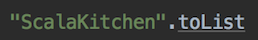

<script>
  ((window.gitter = {}).chat = {}).options = {
    room: 'ScalaTaiwan/ScalaTaiwan'
  };
</script>
<script src="https://sidecar.gitter.im/dist/sidecar.v1.js" async defer></script>

# Implicits

Implicit是一個Scala非常有特色的一個功能。它可以讓使用者省去自己傳入參數的麻煩。讓library的建立者設計簡潔好用但同時保留彈性的API。
在一般的語言裡，不管我們要做什麼事都必須自行在呼叫或使用的地方寫出我們要呼叫的地方或傳入的參數，這種方式叫explicit。Implicit就是在某些特定的條件下讓你可以不用直接寫出你所要呼叫的method或傳入的參數，把這件事丟給compiler去做。這樣可以達到API的使用方便和程式碼的減少（當然對API/Library有一定了解還是需要的）。Implicit是一個keyword，它可以出現在val，def，class，object前面。當`implicit`出現在這些地方就表示這些東西可以implicitly被使用到。在使用implicit的地方也會用implicit的keyword出現所以不用擔心不知道是不是有implicit的使用。但宣告implicit之後並不表示不能強制傳入自己想要的參數。

有些人可能會想，既然不用直接宣告要用的東西，那會不會有runtime效能的問題或是增加runtime debug時的複雜度。runtime時的問題都不存在。Implicit是一個在compile time就會被決定的事情。如果implicit的檢查不過，compile是不會成功的。Compile出來的程式碼也是被用implicit的規則計算過後直接inline進去的。所以也不用擔心有runtime被改掉或換掉的問題。

Implicit基本上分兩種:

1. parameter
2. conversion

### Implicit Parameters

Implicit parameter是一種不需要指定宣告傳入就可以使用的參數。Compiler會在compile的時候會在這個call site的context裡面尋找可以使用的parameter然後放入。如果找不到就會有錯。如果要讓我們的method可以使用implicit的參數，只要在參數的前面宣告implicit就可以了。可是通常我們的method都還是會有一些必須讓使用者自行輸入的參數，這時候兩種參數必須被分開在兩個不同的parameter list裡面，而且implicit的必須在最後面。

```scalaFiddle

implicit val name = "ScalaKitchen"

def sayHello(implicit name: String): Unit = println(s"Hello $name")

def saySomethingTo(phrase: String)(implicit name: String): Unit = println(s"$phrase -> $name")

sayHello

saySomethingTo("All Hail")

saySomethingTo("stop implicit on")("scala implicit parameter")

```

### Implicit Conversion

Implicit conversion可以利用implicit的method或class來自動轉換原本的資料型態來免除一些不必要的程式碼。主要發生的地方在當我們需要一個`B`可是我們只有一個`A`的時候。在這裡如果有一個`f: A => B`的function那就可以直接使用了，可是還是需要去呼叫`f`，`f(a)`。可是如果用implicit，就不需要這麼麻煩了。
另外像平常在寫Web service的程式的時候通常會直接把物件當作return值回傳。可是其實最後的結果都是由某個framework在後面處理掉了，例如Apache CXF，Jersey，Spring MVC，等。
Implicit conversion可以達到類似的效果。

```scalaFiddle height="600"

//原本
val i = 123

def cookString(s: String): String = s"cooked $s in ScalaKitchen"

println("no implicit: " + cookString(i.toString))
println("----------")

//加一個Int => String的implicit function
implicit def intToString(i: Int): String = i.toString
println("with implicit: " + cookString(i))
println("----------")

//假設一個web service的API要求回傳JSON，(Request) => Json
case class Request(params: Map[String, String])
case class Json(json: String)
trait Webservice {
  def doGet(request: Request): Json
}

//可是平常在使用事的API都是一般的domain object例如Customer, User等
case class User(name: String)

class UserApi extends Webservice {
  def doGet(request: Request): Json = {
    val user = User("ScalaKitchen")
    //要自己轉換型態
    Json(s"""{"name": "${user.name}"}""")
  }
}

val api = new UserApi
println("no implicit: " + api.doGet(Request(Map.empty)))
println("----------")
//如果使用implicit，只要先定義好一個(User) => Json的method就可以了

implicit def userToJson(user: User): Json = Json(s"""{"name": "${user.name}"}""")

class UserApiWithImplicit extends Webservice {
  def doGet(request: Request): Json = {
    val user = User("implicit ScalaKitchen")
    user
  }
}

val api2 = new UserApiWithImplicit
println("with implicit: " + api2.doGet(Request(Map.empty)))
println("----------")

```

### Library Pimping

知道implicit conversion之後，可以再對這個功能做一些延伸。既然implicit conversion可以再assign和return的時候將A轉成B，那也就可以在使用的當下直接轉成B然後使用B的method。這樣可以創造出一個A也有B的功能的假象。利用這個特性我們可以達到在一個3rd-party library或是被宣告成`final`的class上面加功能，而不影響它原有的source，可是使用起來還是感覺在使用原本的API。這行為被稱為library pimping，或 "pimp my library"。

常用的class String就是一個final的class。可是在一般的運用上，常常會需要把一個原始的String轉換成要使用的domain object或單純的Int，Double或Date。

```scalaFiddle

case class Json(json: String)

import java.time._
//先宣告一個class來放我們要對String增加的method
class MyString(s: String) {
	def toInteger(): Int = s.toInt
	def toJson(): Json = Json(s)
}

object MyString {
	implicit def toMyString(s: String): MyString = new MyString(s)
}

import MyString._

val i = "12345".toInteger
println(s"class of i: ${i.getClass}, $i")

val json = """{"name" : "ScalaKitchen}""".toJson
println(s"class of json: ${json.getClass.getSimpleName}, $json")

```

Note:
其實在Scala內建的library就有應用這樣的技巧。如果注意看一下Scala的String其實就是java.lang.String。可是為什麼在寫程式的時候可以寫`.toDouble`或`.toInt`甚至是`.reverse`或`.foldLeft`等？這就是利用這種implicit conversion的技巧達到在原本沒什麼功能的String上加上這些功能而又不影響原本String該有的特性。至於負責做String轉換的程式在哪裡就留給有興趣的人去自己去找了。

另外如果使用Eclipse或Intellij開發的朋友，如果在method或變數名稱下面多了一個底線的話就是被套用了implicit。例如`.toList`，


### View Bounds

如果我們將implicit parameter跟conversion合併在一起還可以達到其它的效果例如現在要介紹的view bound。
例如我們想要接受一個`List[A]`然後檢查裡面是否存在`a`。

```scala
def contains[A](as: List[A], a: A): Boolean = as.contains(a)
```

可是其實只要是任何可以被轉換成List[A]的物件，都可以用這個程式。像是String可以被轉成List所以應該也要可以用這個method。

```scala
val sl = "abc".toList
contains(sl, 'a')
```

這樣呼叫起來很麻煩我們可以把`.toList.map`變成一個implicit conversion然後在`contains`上面加一個implicit parameter。

```scalaFiddle
//改寫contains
def contains[A, LA](as: LA, value: A)(implicit conv: LA => List[A]) = {
  as.contains(value)
}

//加一個implicit converter
implicit def stringToList(s: String): List[Char] = new scala.collection.immutable.StringOps(s).toList

val s = "ScalaKitchen"

println(s"ScalaKitchen contains 'a'? ${contains(s, 'a')}")

println(s"ScalaKitchen contains 's'? ${contains(s, 's')}")

```

利用有點syntax sugar，`contains`還可以被改寫的簡單一點

```scalaFiddle
//改寫contains
def contains[A, LA <% List[A]](as: LA, value: A) = {
  as.contains(value)
}

//加一個implicit converter
implicit def stringToList(s: String): List[Char] = new scala.collection.immutable.StringOps(s).toList

val s = "ScalaKitchen"

println(s"ScalaKitchen contains 'a'? ${contains(s, 'a')}")

println(s"ScalaKitchen contains 's'? ${contains(s, 's')}")

```

在這裡`LA <% List[A]`就被稱為 **_View Bound_**。`LA <% List[A]`為上限_Upper Bound_，`LA %> List[A]`為下限_Lower Bound_。
可以把這個當作是一種“證明”，在執行的環境下，你必須要證明`LA`在某種邏輯下也是`List[A]`的一種，你才能使用這個method。同樣的這個檢查都會在compile time的時候就做完。

### Context Bound

另外一個常看到的用法叫context bound。這給大量的使用在[type class pattern](https://blog.scalac.io/2017/04/19/typeclasses-in-scala.html)裡面。這個pattern讓沒有implement一些interface的class擁有一樣的功能。它同時具有[bridge pattern](https://en.wikipedia.org/wiki/Bridge_pattern)和[adapter pattern](https://en.wikipedia.org/wiki/Adapter_pattern)的特性。

用scala的standard library裡面的`Ordering`來做範例(Ordering基本上就是Java的Comparator)。

使用`Ordering`來付與任何物件比較與順序的能力。
之後再利用syntax sugar讓是用此pattern的API看起來更簡潔跟明確。

```scalaFiddle

def compare[A](a: A, a1: A)(implicit ordering: Ordering[A]): Int = {
  if(ordering.equiv(a, a1)) 0
  else if(ordering.gt(a, a1)) 1
  else -1
}

case class Student(number: Int, nickname: String)

//實作一個可以操作Student的Ordering，這裡利用Student.number來做自然排序
implicit val studentOrdering = Ordering.by[Student, Int](s => s.number)

val s1 = Student(1, "One")
val s3 = Student(3, "Three")
val s4 = Student(4, "Four")

println("student 3在student 1後面: " + (compare(s3, s1) == 1))


println("------------")

//利用syntax sugor讓Ordering變成一個context bound的形式
def compareWithBound[A : Ordering](a: A, a1: A): Int = {
  val ordering = implicitly[Ordering[A]]
  if(ordering.equiv(a, a1)) 0
  else if(ordering.gt(a, a1)) 1
  else -1
}

println("student 3還是在student 1後面: " + (compareWithBound(s3, s1) == 1))


```
`[A: Ordering]`就形成了這個method的context bound。
如果沒有一個這樣的context bound，Ordering[A]的時候會怎樣？

```scalaFiddle
def compareWithBound[A : Ordering](a: A, a1: A): Int = {
  val ordering = implicitly[Ordering[A]]
  if(ordering.equiv(a, a1)) 0
  else if(ordering.gt(a, a1)) 1
  else -1
}

case class Teacher(id: String, name: String)
//可以嘗試把打開這個implicit就可以讓這段程式碼compile
//implicit val teacherOrdering = Ordering.by[Teacher, Int](t => t.id)

val t1 = Teacher("ID1", "Scala")
val t2 = Teacher("ID2", "Kitchen")

println("因為沒有一個Ordering[Teacher]在context裡面，所以Teacher沒辦法使用compareWithBound，連compile都不會過")
compareWithBound(t1, t2)

```


### Implicit的來源跟順序

看完implicit可以做到的事之後，就有來看implicit到底怎麼進入使用的scope/context，來達到使用者感覺不到和美化API的效果。

先了解compiler什麼時候知道或會嘗試套用implicit?
  1. 在一個物件上呼叫一個method可是這個物件並沒有這個method
  2. 在呼叫一個有implicit parameter的method

Compiler在尋找implicit的順序如下：(1會比2有優先權，如果有相等優先權，就會比較那一個比較精準)

  1. 在當下的scope尋找
    * [宣告在當下scope的implicit](unchecked:#same-implicit-scope)
    * [explicit import](unchecked:#explicit-import)
    * [wildcard import](unchecked:#wildcard-import)
  2. 尋找相關類別(associated type)
    * [companion objects](unchecked:#companion-objects)
    * [implicit scope of an argument's type](unchecked:#argument-implicit-scope)
    * [implicit scope of type arguments](unchecked:#implicit-scope-of-type-arguments)
    * [outer objects for nested types](unchecked:#outer-object-nested)
    

這些到底是什麼意思呢？
以下是範例：

  * <a id="same-implicit-scope"></a>__宣告在當下scope的implicit__

  ```scala
  implicit val n: Int = 5
  def add(x: Int)(implicit y: Int) = x + y
  add(5) //將n從當下的scope拿進來，也是最直接的
  ```

  * <a id="explicit-import"></a>__explicit import__

  直接將要用的implicit指名道姓的import進來

  ```scala
  import scala.collection.JavaConversions.mapAsScalaMap
  def env = System.getenv() // 這裡是一個Java map
  val term = env("TERM")    // 直接使用mapAsScalaMap這個implicit conversion將Java Map轉成Scala Map
  ```

  * <a id="wildcard-import"></a>__wildcard import__

  用`_`的方式import進來，會被explicit import的方式蓋過，因為explicit import比較精確。

  ```scala
  import scala.collection.JavaConversions._
  def env = System.getenv() // 這裡是一個Java map
  val term = env("TERM")    // 使用JavaConversions裡面的mapAsScalaMap這個implicit conversion將Java Map轉成Scala Map
  ```

  * <a id="companion-objects"></a>__companion objects__

    在這裡companion object會在兩個地方出現

      1. **"source" object的companion object**

      舉例在下面的例子在`Option`的companion object裡面有一個implicit coverter將`Option`轉換成`Iterable`，所以在任何時候都可以在`Option`上使用`Iterable`的method或是將`Option`傳給需要`Iterable`的method。

      ```scala
      for {
        x <- List(1, 2, 3)
        y <- Some('x')
      } yield, (x, y)
      ```

      會被轉換成

      ```scala
      List(1, 2, 3).flatMap(x => Some('x').map(y => (x, y)))
      ```

      可是在這裡`List.flatMap`要求的是`TraversableOnce`。可是`Option`不是。這時候compiler就會在`Option`的companion object裡面找到這個implicit coverter然後將`Option`轉換成`Traversable`同時也是`TraversableOnce`。

      2. **要求類型的companion object**

      ```scala
      List(1, 2, 3).sorted
      ```

      在這裡`.sorted`需要一個implicit的`Ordering`。這時候compiler會在Ordering的companion object裡面尋找，會找到一個implicit`Ordering[Int]`。另外如果`Ordering`有super class的companion object的話，compiler也會進去找。

      ```scalaFiddle
      class A(val n: Int)
      object A { 
        implicit def str(a: A) = "A: %d" format a.n
      }
      class B(val x: Int, y: Int) extends A(y)
      val b = new B(5, 2)
      val s: String = b  
      println(s)
      ```

  * <a id="argument-implicit-scope"></a>__implicit scope of an argument's type__

    如果一個method的argument是type`A`那`A`的"implicit scope"也會被納入(Implicit Scope就是一整個這一篇談到的所有implicit檢查條件重複的檢查一直到最後找到或完全找不到)。這表示不止是`A`裡面的implicit conversion會被套用在這個parameter上，而是一整個expression都有可能用的到。

    ```scalaFiddle
    class A(val n: Int) {
      def +(other: A) = new A(n + other.n)
    }
    object A {
      implicit def fromInt(n: Int) = new A(n)
    }

    //可以寫成這樣了
    1 + new A(1)
    //會被轉換成下面的expression
    println(s"A.n: ${(A.fromInt(1) + new A(1)).n}")
    ```

  * <a id="implicit-scope-of-type-arguments"></a>__implicit scope of type arguments__

    這是讓type class可以正常運作的條件。以`Ordering`為例，`Ordering`本身就有一下implicit可以用，可是卻不能在它裡面再增加。那怎麼能讓在需要`Ordering`的時候可以有需要的implicit `Ordering`呢？

    如果有：

    ```scala
    class A(val n: Int)
    object A {
        implicit val ord = new Ordering[A] {
            def compare(x: A, y: A) = implicitly[Ordering[Int]].compare(x.n, y.n)
        }
    }
    ```

    然後再來要sort

    ```scala
    List(new A(5), new A(2)).sorted
    ```

    這裡我們知道`sorted`需要一個`Ordering[A]`，可是在`Ordering`跟`List`(source type)裡面都沒有。這時候就會進`A`去找。`A`就是`Ordering[A]`的 **_type argument_**。

    **Note**: 如果有看過List/Seq的ScalaDoc的話，可能在很多API會注意到一個`CanBuildFrom`的implicit參數，它就是用這個機制在你不需要知道去哪裡找這個東西的時候幫你放進來的。

  * <a id="outer-object-nested"></a>__outer objects for nested types__
    
    當有inner class的時候，該class的outer class也會成為被搜尋implicit的對象。

    ```scalaFiddle
    class A(val n: Int) {
      class B(val m: Int) { require(m < n) }
    }
    object A {
      implicit def bToString(b: A#B) = "B: %d" format b.m
    }
    val a = new A(5)
    val b = new a.B(3)
    val s: String = b  
    println(s)
    ```

**_Note_: Implicit Scope包含package object**

Implicit Scope的範圍另外包含的對應types所屬的package的package object。

_(以下範例必須貼到一個scala檔案裡面用main來執行)_

```scala src=../main/scala/scalataiwan/snippet/PackageImplicit.scala sourceLinkURI=https://github.com/ScalaTaiwan/ScalaKitchen/src/main/scala/scalataiwan/snippet/PackageImplicit.scala

```

---

References:
  1. [Scala Doc](https://www.scala-lang.org/files/archive/spec/2.12/07-implicits.htm)
  2. [Stackoverflow](https://stackoverflow.com/questions/5598085/where-does-scala-look-for-implicits)
  3. [Implicits without the import tax](http://jsuereth.com/scala/2011/02/18/2011-implicits-without-tax.html)
  4. [The Scala Type System](https://blog.codecentric.de/en/2015/03/scala-type-system-parameterized-types-variances-part-1/)
  5. [Implicit scope include package object](https://issues.scala-lang.org/browse/SI-4427)


