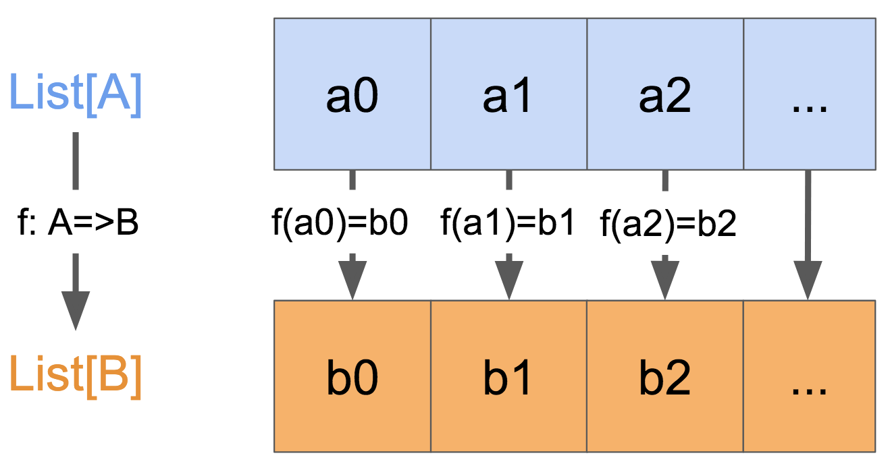

<script>
  ((window.gitter = {}).chat = {}).options = {
    room: 'ScalaTaiwan/ScalaTaiwan'
  };
</script>
<script src="https://sidecar.gitter.im/dist/sidecar.v1.js" async defer></script>

# map/flatMap/filter

## map
`map`在數學上也稱[映射](https://zh.wikipedia.org/wiki/%E6%98%A0%E5%B0%84), 
而在scala中即表示任一個集合`List[A]`中的每個元素`a`均可透過函數`f`轉換為元素`b`, 進而產生一個新的集合`List[B]`, 如下圖 



例如，把Int轉換成String就是Int map to String。


map就會需要用一個function來做到轉換的功能，map的method signature長這樣`.map(f: A => B)`。這裡f就是一個可以把A轉換到B的function(A和B不一定是不同類型，也可以是同樣類型)。

在scala很多資料結構都有map這個功能。這個功能非常的強大。它讓你可以在不重組整個資料結構就可以將裡面的內容轉換成另外一種類別。

map的method signature長這樣`.map(f: A => B)`

```scala
//example:  Int map to string
val ints:List[Int]=List(1,2,3,4,5)
val strs:List[String]=ints.map(i=>i.toString)
```

另一個例子，如果你有一個`List[Int]`，這個List裡面都是學生學號，可是你要的是這些學號對應的學生。

```scalaFiddle

case class Student(number: Int, nickname: String)
//在真實生活這裡應該會是一個類似DB查詢的動作
def toStudent(n: Int): Student = Student(n, s"Student $n")

val studentNumbers = List(1,2,3,6,9,200)
val students = studentNumbers.map(toStudent)
println(students)

println("==========")
//當然也可以直接用anonymous function
println(studentNumbers.map(n => Student(n, "anonymous student " +n)))

```

## flatMap

`map`是一個將A轉成B的function。可是在實務上常常會是A轉成List[B]。
而`flatMap`的用意就是可以把裡面一層的資料結構壓平，直接將資料攤平在外面的階層。
例如我們有一個method`def toStudents(classNumber: Int): List[Student]`，它是用課堂編號取得所有在這個課堂內的學生清單。
可是需求是從一個課堂編號的清單取得所有這些課堂內的學生（不管是否重複）。

如果我們只用map的話會變成這樣

```scalaFiddle
case class Student(number: Int, nickname: String)

def toStudents(classNumber: Int): List[Student] = 
    for(i <- List.range(1, classNumber)) 
        yield Student(i, s"student $i from class ${classNumber}")


val classNumbers = List(2,0,3,6)

println(classNumbers.map(toStudents))
```

我們上面得到的是`List[List[Student]]`，可是這不是我們要的，而且裡面還有一個空的List。

這時候只要把map換成flapMap就可以了

```scalaFiddle
case class Student(number: Int, nickname: String)

def toStudents(classNumber: Int): List[Student] = 
    for(i <- List.range(1, classNumber)) 
        yield Student(i, s"student $i from class ${classNumber}")


val classNumbers = List(2,0,3,6)

println(classNumbers.flatMap(toStudents))
```

這裡我們要的`List[Student]`就很輕易的得到了，而且也沒有那個空的List在佔位置了。

## filter

filter的概念很簡單，就是過濾，把不要的東西刪除掉並把符合條件的留下。

```scalaFiddle

val l = List.range(1, 100)

//取單數
println(l.filter(i => i % 2 > 0))

```

## Additional

其實在寫程式的時候，大部分的工作都可以被歸類成map/flatMap/filter。
大家可以好好思考一下是不是真的是如此？

簡單的例子，大家熟悉的SQL。有興趣可以參考[Slick](http://slick.lightbend.com/doc/3.2.1/queries.html)這個library。

就延續上面Student的例子，再加上課堂與學生關聯的物件
```scala
case class Student(number: Int, nickname: String)
//省略課堂這個物件
case class ClassStudent(classNumber: Int, studentNumber: Int)
```
SQL應該會長這樣（另外在加上我們只要基數學生號這個條件）
```sql

SELECT s.* 
FROM ClassStudent cs 
JOIN Student s ON cs.studentNumber = s.number
WHERE s.number % 2 != 0
  AND cs.classNumber in (2,0,3,6)
```

用map/flatMap/filter

```scala

List(2,0,3,6).flatMap(findClassStudent)
             .map(cs => toStudent(cs.studentNumber))
             .filter(s => s.number % 2 > 0)
```


